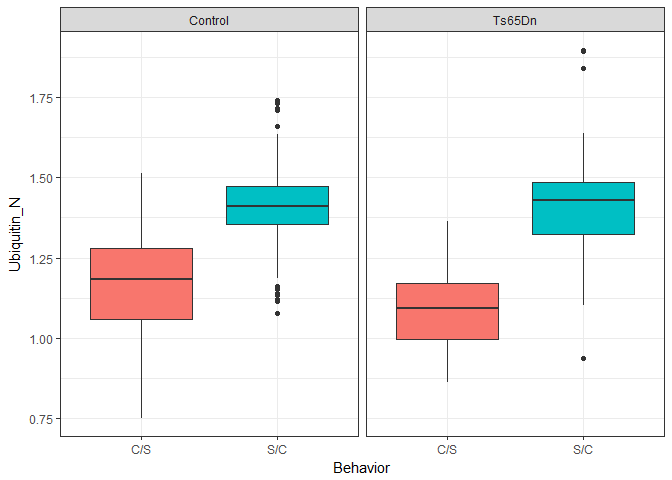

---?image=style/KU-background.png&size=contain
### Data analysis and statistical methods
### in R
#### Adrian Gabriel Zucco 
##### Center for Translational Neuromedicine

---

### Pre-requisites
- Install [R](https://mirrors.dotsrc.org/cran/)
- Install [RStudio](https://www.rstudio.com/products/rstudio/download/#download)

#### Libraries
Execute inside R:
```r
install.packages("tidyverse")
install.packages("readxl")
```

---

### [Mice Protein Expression Data Set](https://archive.ics.uci.edu/ml/datasets/Mice+Protein+Expression#)

Expression levels of 77 proteins measured in the cerebral cortex of 8 classes of control and Down syndrome mice exposed to context fear conditioning, a task used to assess associative learning.
<br>
<font size="3">

  Higuera, C., Gardiner, K.J. and Cios, K.J., 2015. Self-organizing feature maps identify proteins critical to learning in a mouse model of down syndrome. PloS one, 10(6), p.e0129126.

</font >

---

### Import data into R
There are different functions to import data into R according to the format of the file:
```r
# Excel files
data = read_excel("./your_dataset.xls")
# Tab-separated files (each column separated by a tab)
data = read_tsv("./your_dataset.tsv")
# Comma-separated files
data = read_csv("./your_dataset.csv")
```
In our case:
```r
data = read_excel("../datasets/Data_Cortex_Nuclear.xls")
```

---

### Have a look at the data
```r
# Execute the variable that stores the data to see its content
print(data)
```

+++

Output:
```
# A tibble: 1,080 x 82
   MouseID DYRK1A_N ITSN1_N BDNF_N NR1_N NR2A_N pAKT_N pBRAF_N pCAMKII_N pCREB_N pELK_N pERK_N pJNK_N PKCA_N pMEK_N
   <chr>      <dbl>   <dbl>  <dbl> <dbl>  <dbl>  <dbl>   <dbl>     <dbl>   <dbl>  <dbl>  <dbl>  <dbl>  <dbl>  <dbl>
 1 309_1      0.504   0.747  0.430  2.82   5.99  0.219   0.178      2.37   0.232   1.75  0.688  0.306  0.403  0.297
 2 309_2      0.515   0.689  0.412  2.79   5.69  0.212   0.173      2.29   0.227   1.60  0.695  0.299  0.386  0.281
 3 309_3      0.509   0.730  0.418  2.69   5.62  0.209   0.176      2.28   0.230   1.56  0.677  0.291  0.381  0.282
 4 309_4      0.442   0.617  0.359  2.47   4.98  0.223   0.176      2.15   0.207   1.60  0.583  0.297  0.377  0.314
 5 309_5      0.435   0.617  0.359  2.37   4.72  0.213   0.174      2.13   0.192   1.50  0.551  0.287  0.364  0.278
 6 309_6      0.448   0.628  0.367  2.39   4.81  0.219   0.176      2.14   0.195   1.44  0.566  0.290  0.364  0.267
 7 309_7      0.428   0.574  0.343  2.33   4.47  0.225   0.184      2.01   0.196   1.61  0.510  0.300  0.371  0.278
 8 309_8      0.417   0.564  0.328  2.26   4.27  0.215   0.180      2.01   0.190   1.42  0.501  0.283  0.359  0.256
 9 309_9      0.386   0.538  0.318  2.13   4.06  0.207   0.168      1.86   0.181   1.26  0.477  0.267  0.337  0.243
10 309_10     0.381   0.499  0.362  2.10   3.60  0.228   0.188      1.72   0.188   1.41  0.455  0.324  0.368  0.284
# ... with 1,070 more rows, and 67 more variables: pNR1_N <dbl>, pNR2A_N <dbl>, pNR2B_N <dbl>, pPKCAB_N <dbl>,
#   pRSK_N <dbl>, AKT_N <dbl>, BRAF_N <dbl>, CAMKII_N <dbl>, CREB_N <dbl>, ELK_N <dbl>, ERK_N <dbl>, GSK3B_N <dbl>,
#   JNK_N <dbl>, MEK_N <dbl>, TRKA_N <dbl>, RSK_N <dbl>, APP_N <dbl>, Bcatenin_N <dbl>, SOD1_N <dbl>, MTOR_N <dbl>,
#   P38_N <dbl>, pMTOR_N <dbl>, DSCR1_N <dbl>, AMPKA_N <dbl>, NR2B_N <dbl>, pNUMB_N <dbl>, RAPTOR_N <dbl>,
#   TIAM1_N <dbl>, pP70S6_N <dbl>, NUMB_N <dbl>, P70S6_N <dbl>, pGSK3B_N <dbl>, pPKCG_N <dbl>, CDK5_N <dbl>,
#   S6_N <dbl>, ADARB1_N <dbl>, AcetylH3K9_N <dbl>, RRP1_N <dbl>, BAX_N <dbl>, ARC_N <dbl>, ERBB4_N <dbl>,
#   nNOS_N <dbl>, Tau_N <dbl>, GFAP_N <dbl>, GluR3_N <dbl>, GluR4_N <dbl>, IL1B_N <dbl>, P3525_N <dbl>,
#   pCASP9_N <dbl>, PSD95_N <dbl>, SNCA_N <dbl>, Ubiquitin_N <dbl>, pGSK3B_Tyr216_N <dbl>, SHH_N <dbl>, BAD_N <dbl>,
#   BCL2_N <dbl>, pS6_N <dbl>, pCFOS_N <dbl>, SYP_N <dbl>, H3AcK18_N <dbl>, EGR1_N <dbl>, H3MeK4_N <dbl>,
#   CaNA_N <dbl>, Genotype <chr>, Treatment <chr>, Behavior <chr>, class <chr>
```

---

### Type of variables
<font size="5" >
<table >
  <tr>
    <th></th>
    <th>Description</th>
    <th>Example</th>
  </tr>
  <tr>
    <td>``int``</td>
    <td>integers</td>
    <td>1, 2, 3 ,4</td>
  </tr>
  <tr>
    <td>``dbl``</td>
    <td>doubles or real numbers</td>
    <td>1.0, 2.3, 3.623, 4.78</td>
  </tr>
  <tr>
    <td>``chr``</td>
    <td>characters or string (text)</td>
    <td>"Hello", "wild-type", "1"</td>
  </tr>
  <tr>
    <td>``dttm``</td>
    <td>date-times</td>
    <td>"2018-06-09 16:45:40"</td>
  </tr>
  <tr>
    <td>``lgl``</td>
    <td>logical</td>
    <td>TRUE / FALSE</td>
  </tr>
  <tr>
    <td>``fctr``</td>
    <td>factors</td>
    <td>1, 1, 2, 3, 4, 4 Levels: 1, 2, 3, 4</td>
  </tr>
  <tr>
    <td>``date``</td>
    <td>dates</td>
    <td>"2018-06-09"</td>
  </tr>
</table>
</font>
---

### Play with your data!

Manipulation of dataframes can be done with native `R` functions but more easily using the `dplyr` library inside `tidyverse`. Common functions:

- `filter()` to keep rows based on conditions
- `arrange()` to sort values
- `select()` columns
- `mutate()` to change or add columns values
- `group_by()` and `summarise()` by count, mean, etc.
- The `%>%` pipe to connect functions
<br>
<font size="3">

  More info: [R for Data Science](http://r4ds.had.co.nz/)

</font>
+++

#### An example:

``` r
# Store operations in a variable with <- or =
ubiquitin_subset <-
  # Select the columns to keep, to select everything but a column use -
  data %>% select(MouseID,
                  Ubiquitin_N,
                  Genotype,
                  ends_with("vior"),
                  contains("Treat") ,
                  class) %>%
  # Keep rows of class c-CS-m and c-SC-m
  filter(class %in% c("c-CS-m", "t-CS-m", "c-SC-m", "t-SC-m")) %>%
  # Sort increasing values by default, use desc(column_name) for descending
  arrange(Ubiquitin_N)
# Show the results
ubiquitin_subset
```

+++

#### Output:

```
# A tibble: 300 x 6
   MouseID Ubiquitin_N Genotype Behavior Treatment class 
   <chr>         <dbl> <chr>    <chr>    <chr>     <chr> 
 1 3415_13       0.751 Control  C/S      Memantine c-CS-m
 2 3415_14       0.812 Control  C/S      Memantine c-CS-m
 3 3415_15       0.857 Control  C/S      Memantine c-CS-m
 4 309_12        0.912 Control  C/S      Memantine c-CS-m
 5 309_6         0.920 Control  C/S      Memantine c-CS-m
 6 309_11        0.940 Control  C/S      Memantine c-CS-m
 7 309_15        0.942 Control  C/S      Memantine c-CS-m
 8 309_8         0.944 Control  C/S      Memantine c-CS-m
 9 309_9         0.947 Control  C/S      Memantine c-CS-m
10 309_10        0.970 Control  C/S      Memantine c-CS-m
# ... with 290 more rows
```

+++
### Long vs wide data
In our case, when we consider more than one column of protein expression the data is in wide format. Long format would mean one row per Mouse and Protein expression value:

``` r
# All data to long format, for long to wide use spread()
data_long <- data %>% gather(Protein, Expression, contains("_N"))
data_long
```
```
# A tibble: 83,160 x 7
   MouseID Genotype Treatment Behavior class  Protein  Expression
   <chr>   <chr>    <chr>     <chr>    <chr>  <chr>         <dbl>
 1 309_1   Control  Memantine C/S      c-CS-m DYRK1A_N      0.504
 2 309_2   Control  Memantine C/S      c-CS-m DYRK1A_N      0.515
 3 309_3   Control  Memantine C/S      c-CS-m DYRK1A_N      0.509
 4 309_4   Control  Memantine C/S      c-CS-m DYRK1A_N      0.442
 5 309_5   Control  Memantine C/S      c-CS-m DYRK1A_N      0.435
 6 309_6   Control  Memantine C/S      c-CS-m DYRK1A_N      0.448
 7 309_7   Control  Memantine C/S      c-CS-m DYRK1A_N      0.428
 8 309_8   Control  Memantine C/S      c-CS-m DYRK1A_N      0.417
 9 309_9   Control  Memantine C/S      c-CS-m DYRK1A_N      0.386
10 309_10  Control  Memantine C/S      c-CS-m DYRK1A_N      0.381
# ... with 83,150 more rows
```

<font size="3">

  For more info [check this](https://sejdemyr.github.io/r-tutorials/basics/wide-and-long/) and [this](https://rpubs.com/bradleyboehmke/data_wrangling)

</font>

---

### Let's Plot
`R` also has its native functions for plotting but we will use ``ggplot``

For a summary of all the functions of ``ggplot2`` check the [ggplot2 cheatsheet](https://www.rstudio.com/wp-content/uploads/2015/03/ggplot2-cheatsheet.pdf)

+++
<!-- .slide: class="center" -->
``` r
ggplot(data = ubiquitin_subset) +
  # Select your x, y values by column name and which categories for the colors
  geom_boxplot(mapping = aes(y = Ubiquitin_N, x = Genotype, fill = Genotype)) +
  # split the different paired plots and remove the color legends
  facet_grid( ~ Behavior) + guides(fill = FALSE) +
  # one of the predefined themes of ggplot2
  theme_bw()
```


+++
<!-- .slide: class="center" -->
``` r
ggplot(data = ubiquitin_subset) +
  # Boxplots per Behavior grouped by genotype
  geom_boxplot(mapping = aes(y = Ubiquitin_N, x = Behavior, fill = Behavior)) +
  facet_grid( ~ Genotype) + guides(fill = FALSE) +
  theme_bw()
```



---

### Choose a statistical test

Things to consider:

- How many groups you want to compare?
- Are all variables the same type? (very important)
  - Continuous (values in a scale), categorical (classes or ratios).
  - Survival data (special tests)
- Parametric (follows a normal distribution) or non-parametric data?
  - Check it with histograms or qqplots
- Independent or paired samples?
  - E.g. 2 groups of mice vs 1 group of mice before and after treatment

<br>

  > du Prel, J.-B., Röhrig, B., Hommel, G., and Blettner, M. (2010). Choosing Statistical Tests. Dtsch Arztebl Int 107, 343–348.


+++?image=figure-markdown_github/stat2.gif&size=contain

[Source](http://www.efoza.com/post_to-use-which-statistical-test-chart_237239/)

+++?image=figure-markdown_github/stat_flow.jpg&size=contain


<font size="1">

Nam, C.M., and Chung, S.Y. (2012). Statistical methods for medical studies. Journal of the Korean Medical Association 55, 573–581.

</font>
---

### Example:


---

### Useful links
- [R for Data Science](http://r4ds.had.co.nz/) : Main source for this workshop
- [Statistical tests in R](http://r-statistics.co/Statistical-Tests-in-R.html)
- [Data analysis for the Life Sciences](http://genomicsclass.github.io/book/) : Full course that also includes statistical analysis of genomics.
- [R course | Page piccinini](https://pagepiccinini.com/r-course/) : Good videos and explanation of anova, linear models and mixed models.

---